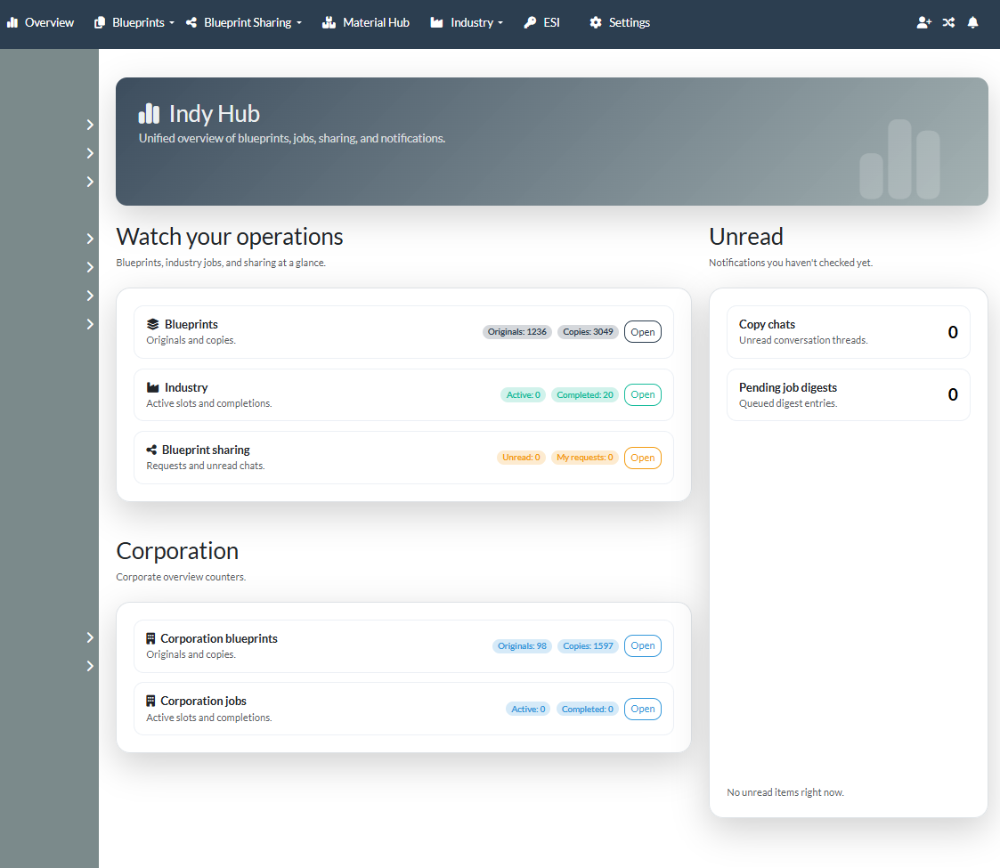
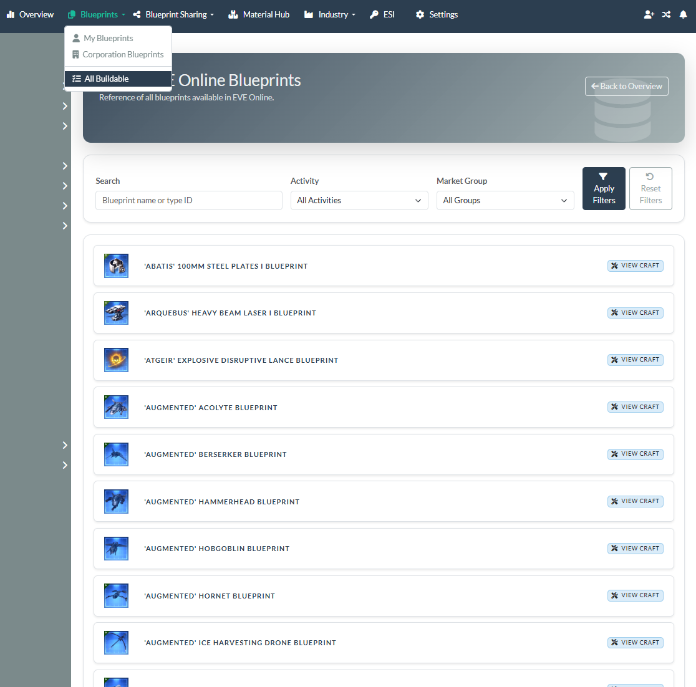
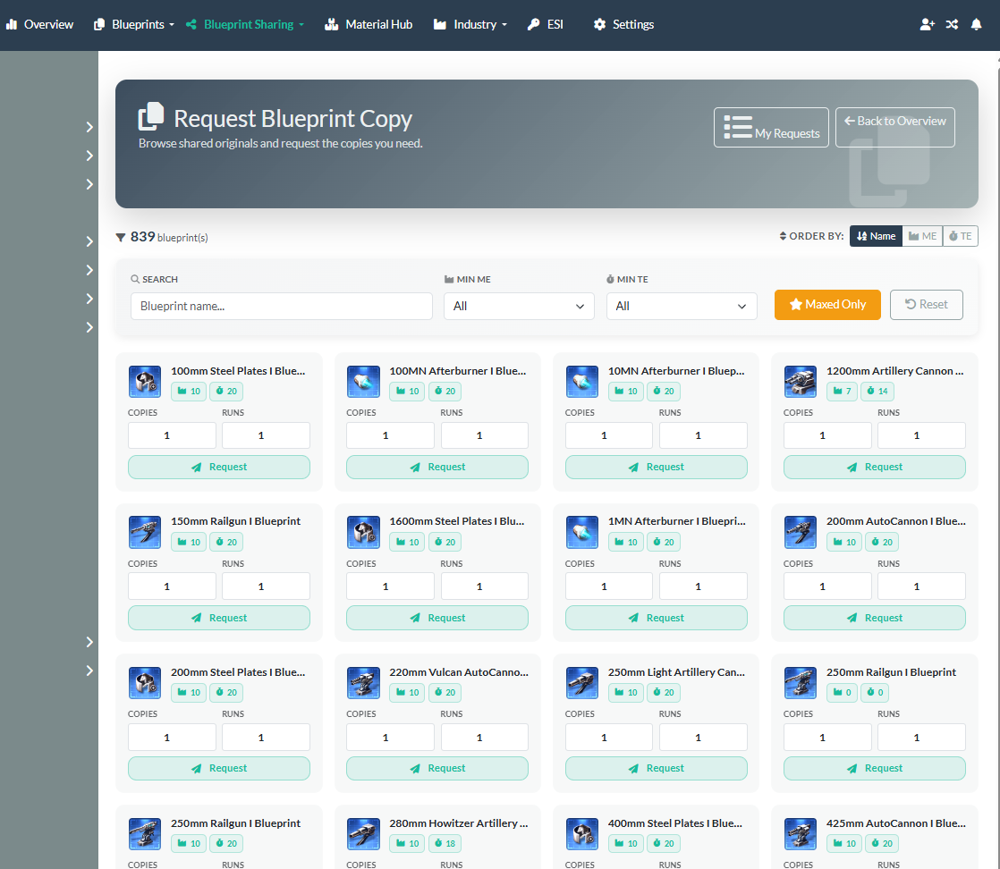
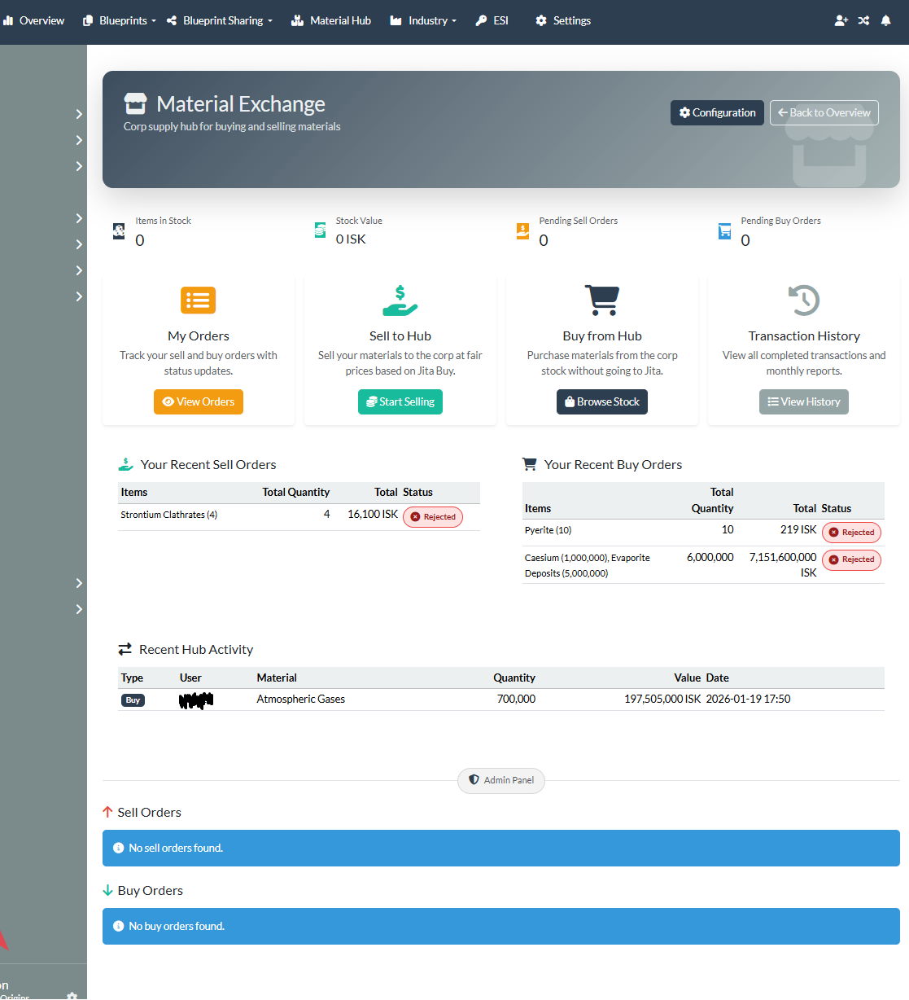
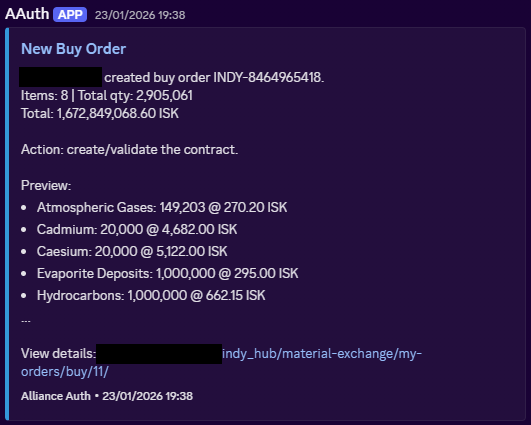
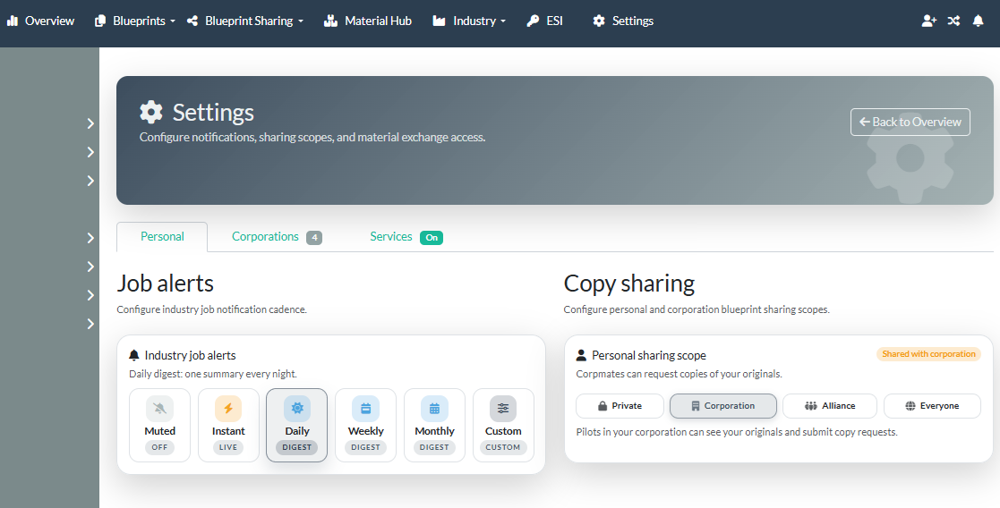

# Indy Hub for Alliance Auth

A modern industry and material‑exchange management module for [Alliance Auth](https://allianceauth.org/), focused on blueprint sharing, job tracking, and corp trading workflows for EVE Online alliances and corporations.

______________________________________________________________________

## Table of Contents

- [About](#about)
  - [Features](#features)
- [Requirements](#requirements)
- [Installation](#installation)
  - [Bare Metal](#bare-metal)
  - [Docker](#docker)
  - [Common](#common)
- [Permissions](#permissions)
  - [Base Access (Required for all users)](#base-access-required-for-all-users)
  - [Corporation Management (Optional)](#corporation-management-optional)
  - [Material Exchange Administration (Optional)](#material-exchange-administration-optional)
- [Settings](#settings)
- [Updating](#updating)
- [Usage](#usage)
- [Screenshots](#screenshots)
- [Contributing](#contributing)

______________________________________________________________________

## About

### Features

- **Blueprint Library**: View, filter, and search all your EVE Online blueprints by character, corporation, type, and efficiency.
- **Industry Job Tracking**: Monitor and filter your manufacturing, research, and invention jobs in real time.
- **Blueprint Copy Sharing**: Request, offer, and deliver blueprint copies (BPCs) with collapsible fulfillment cards, inline access list summaries, signed Discord quick-action links, and notifications for each step.
- **Flexible Sharing Scopes**: Expose blueprint libraries per character, per corporation, or to everyone at once.
- **Conditional Offer Chat**: Negotiate blueprint copy terms directly in Indy Hub with persistent history and status tracking.
- **Material Exchange**: Create buy/sell orders with order references, validate ESI contracts, and review transaction history.
- **Material Exchange UX**: Compact order detail headers with quick-copy helpers (order reference, buyer/corporation, EVE-friendly totals).
- **ESI Integration**: Secure OAuth2-based sync for blueprints and jobs with director-level corporation scopes.
- **Notifications**: In-app alerts for job completions, copy offers, chat messages, and deliveries, with configurable immediate or digest cadences.
- **Modern UI**: Responsive Bootstrap 5 interface with theme compatibility and full i18n support.

## Requirements

- **Alliance Auth v4+**
- **Python 3.10+**
- **Django** (as required by AA)
- **Alliance Auth AppUtils**
- **django-esi** (OpenAPI client, >=8)
- **django-eveuniverse** (populated with industry data)
- **Celery** (for background sync and notifications)
- *(Optional)* Director characters for corporate dashboards
- *(Optional)* [`aadiscordbot`](https://apps.allianceauth.org/apps/detail/allianceauth-discordbot) (preferred) or [`discordnotify`](https://apps.allianceauth.org/apps/detail/aa-discordnotify) for Discord notifications

______________________________________________________________________

## Installation

### Bare Metal

```text
pip install django-eveuniverse indy-hub
```

Add to your `local.py`:

```python
# Add to INSTALLED_APPS
INSTALLED_APPS = [
    "eveuniverse",
    "indy_hub",
]

# EveUniverse configuration
EVEUNIVERSE_LOAD_TYPE_MATERIALS = True
EVEUNIVERSE_LOAD_MARKET_GROUPS = True
```

Run migrations and collect static files:

```text
python manage.py migrate
python manage.py collectstatic --noinput
```

Populate industry data:

```text
python manage.py eveuniverse_load_data types --types-enabled-sections industry_activities type_materials
```

Restart services:

```text
# Restart Alliance Auth
systemctl restart allianceauth
```

### Docker

```text
docker compose exec allianceauth_gunicorn bash
pip install django-eveuniverse indy-hub
exit
```

Add to your `conf/local.py`:

```python
# Add to INSTALLED_APPS
INSTALLED_APPS = [
    "eveuniverse",
    "indy_hub",
]

# EveUniverse configuration
EVEUNIVERSE_LOAD_TYPE_MATERIALS = True
EVEUNIVERSE_LOAD_MARKET_GROUPS = True
```

Add to your `conf/requirements.txt` (Always use current versions)

```text
django-eveuniverse==1.6.0
indy-hub==1.14.0
```

Run migrations and collect static files:

```text
docker compose exec allianceauth_gunicorn bash
auth migrate
auth collectstatic --noinput
exit
```

Restart Auth:

```text
docker compose build
docker compose down
docker compose up -d
```

Populate industry data:

```text
docker compose exec allianceauth_gunicorn bash
auth eveuniverse_load_data types --types-enabled-sections industry_activities type_materials
exit
```

### Common

- Set permissions in Alliance Auth (see [Permissions](#permissions)).
- Authorize ESI tokens for blueprints and industry jobs.

______________________________________________________________________

## Permissions

Assign permissions in Alliance Auth to control access levels:

### Base Access (Required for all users)

- **`indy_hub.can_access_indy_hub`** → "Can access Indy Hub"
  - View and manage personal blueprints
  - Create and manage blueprint copy requests
  - Use Material Exchange (buy/sell orders)
  - View personal industry jobs
  - Configure personal settings and notifications

### Corporation Management (Optional)

- **`indy_hub.can_manage_corp_bp_requests`** → "Can manage corporation indy"
  - View and manage corporation blueprints (director only)
  - Handle corporation blueprint copy requests (accept/reject corp BP copy sharing)
  - Access corporation industry jobs
  - Configure corporation sharing settings
  - This role is **not** meant for everyone — only for people who manage corp BPs (they can handle contracts for corpmates)
  - Requires ESI director roles for the corporation

### Material Exchange Administration (Optional)

- **`indy_hub.can_manage_material_hub`** → "Can manage Mat Exchange"
  - Configure Material Exchange settings
  - Manage stock availability
  - View all transactions
  - This role is **not** meant for everyone — only for people who manage the hub (they accept/reject buy and sell orders made to the corp)
  - Admin panel access

**Note**: Permissions are independent and can be combined. Most users only need `can_access_indy_hub`.

______________________________________________________________________

## Settings

Customize Indy Hub behavior in `local.py`:

```python
# Discord notifications
INDY_HUB_DISCORD_DM_ENABLED = True  # Default: True
INDY_HUB_DISCORD_ACTION_TOKEN_MAX_AGE = 86400  # Default: 24 hours

# ESI compatibility date (OpenAPI)
INDY_HUB_ESI_COMPATIBILITY_DATE = "2025-09-30"  # Default: app default
```

**Scheduled Tasks** (auto-created):

- `indy-hub-update-all-blueprints` → Daily at 03:30 UTC
- `indy-hub-update-all-industry-jobs` → Every 2 hours
- `indy-hub-update-skill-snapshots` → Daily at 04:15 UTC

______________________________________________________________________

## Updating

### Bare Metal Update

```text
# Update the package
pip install --upgrade indy-hub

# Apply migrations
python manage.py migrate

# Collect static files
python manage.py collectstatic --noinput

# Restart services
systemctl restart allianceauth
```

### Docker Update

Update Versions in `conf/requirements.txt` (Always use current versions)

```text
indy-hub==1.14.0
```

Update the Package:

```text
# Exec Into the Container
docker compose exec allianceauth_gunicorn bash

# Update the package
pip install -U indy-hub

# Apply Migrations
auth migrate

# Collect static files
auth collectstatic --no-input

# Restart Services
exit
docker compose build
docker compose down
docker compose up -d
```

______________________________________________________________________

## Usage

1. **Navigate** to Indy Hub in the Alliance Auth dashboard
1. **Authorize ESI** for blueprints and jobs via the settings
1. **View Your Data**:

- Personal blueprints and industry jobs
- Corporation blueprints (if director)
- Pending blueprint copy requests
- Material Exchange buy/sell orders and transaction history

1. **Share Blueprints**: Set sharing scopes and send copy offers to alliance members
1. **Receive Notifications**: View job completions and copy request updates in the notification feed

______________________________________________________________________

## Screenshots

Below are a few UI highlights from the current release.

### Dashboard Overview



### Blueprint Library



### Blueprint Copy Requests



### Material Exchange Hub



### Order Requests



### Discord Notifications


### User Settings



______________________________________________________________________

## Contributing

- Open an issue or pull request on GitHub for help or to contribute

______________________________________________________________________
