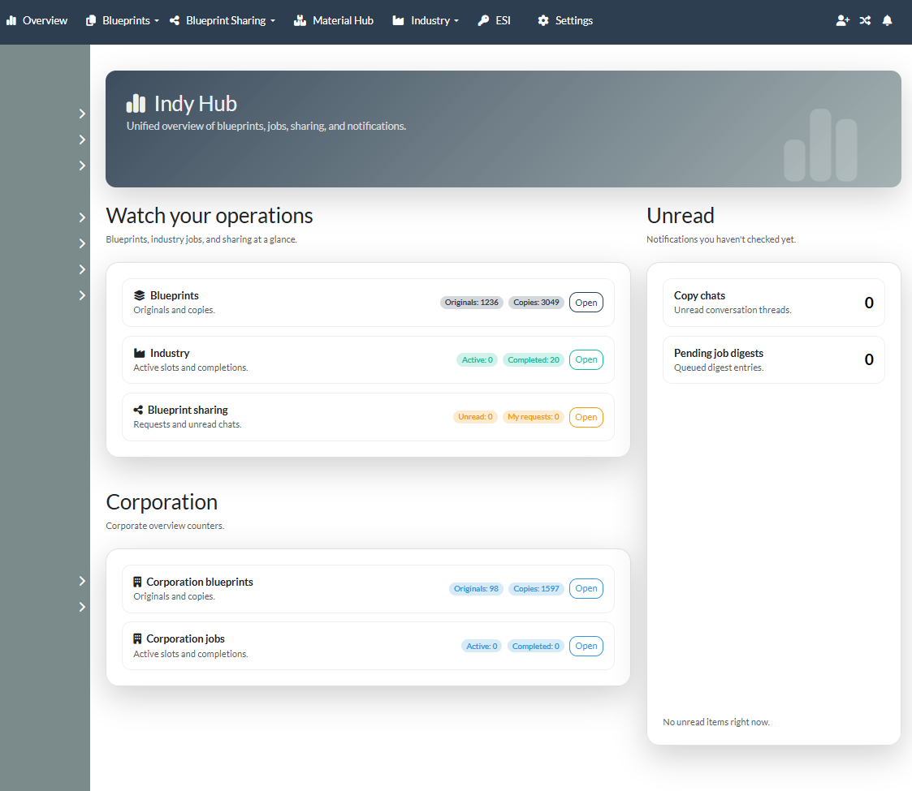
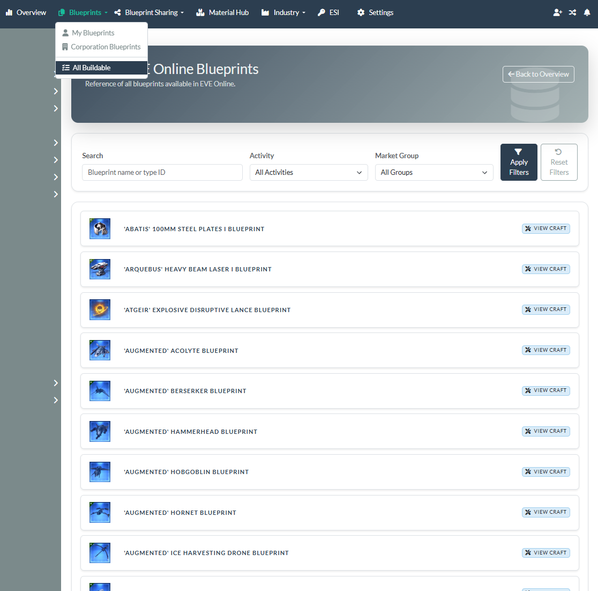
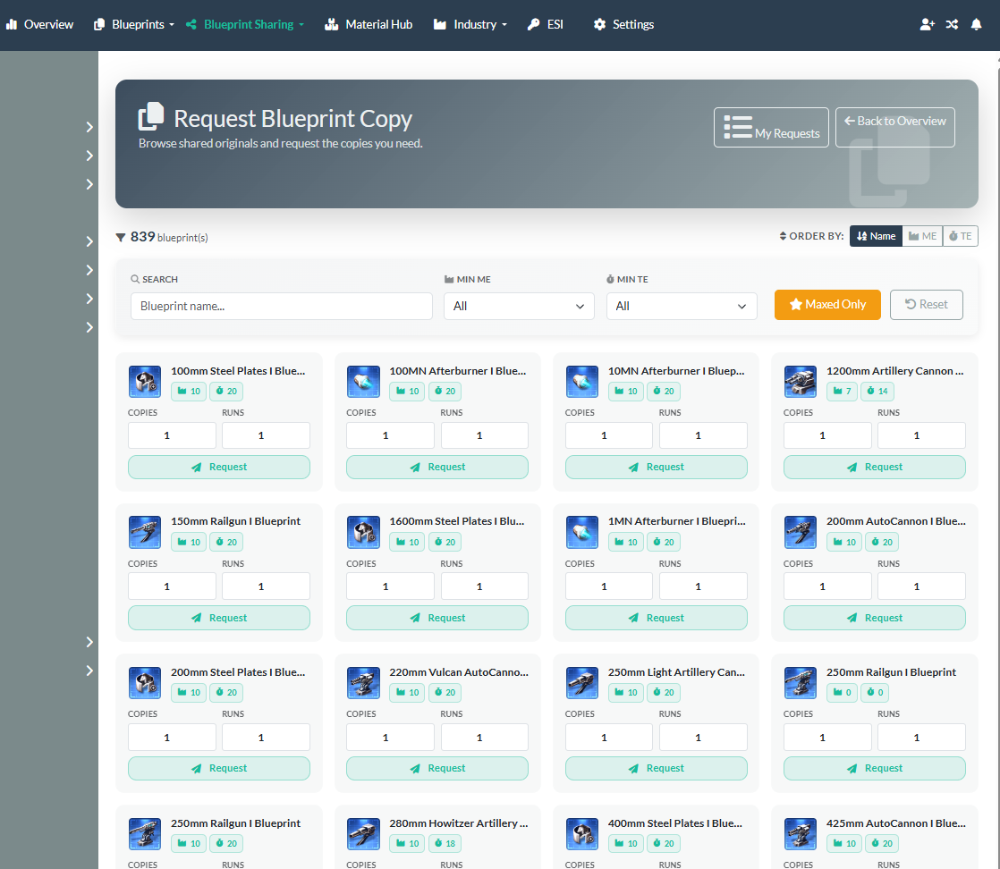
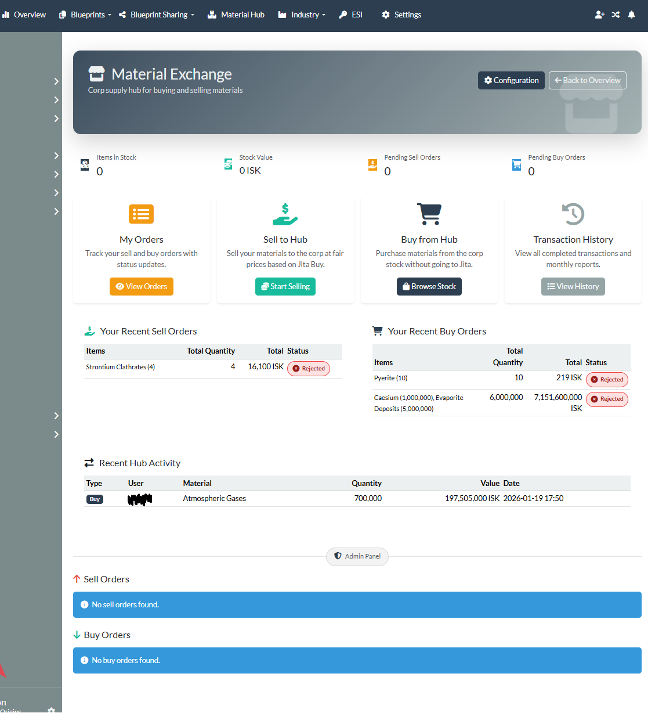
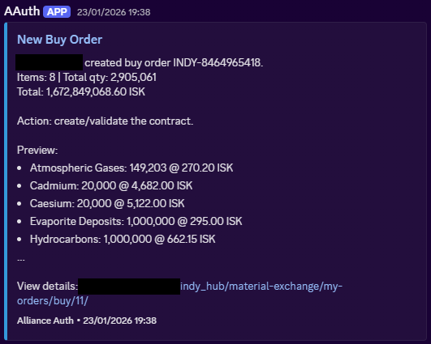
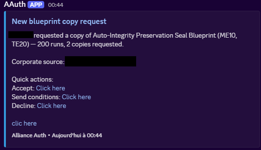
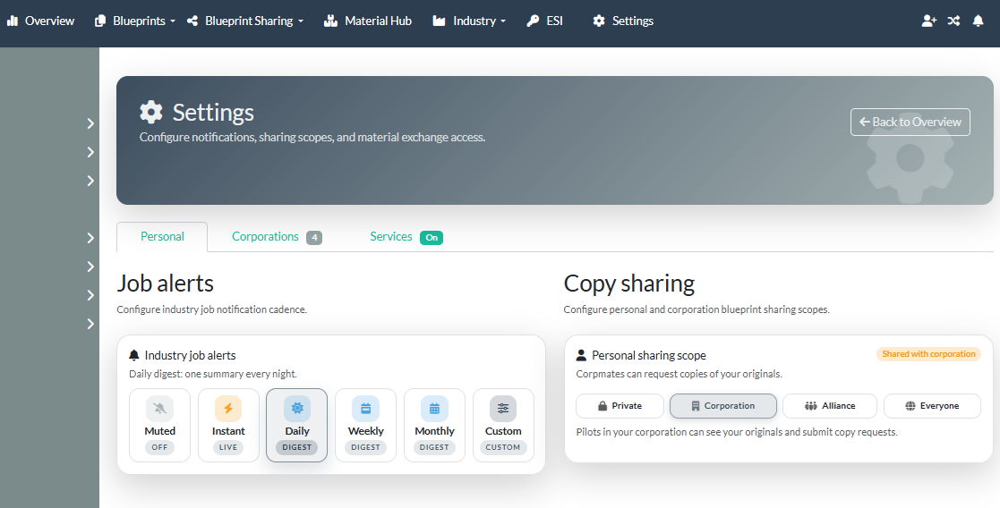

# Indy Hub for Alliance Auth

Indy Hub is an industry and Material Exchange application for
[Alliance Auth](https://allianceauth.org/). It helps EVE Online corporations and
alliances manage blueprints, industry jobs, copy requests, production projects,
and internal material trading.

## Features

- Personal and corporation blueprint libraries
- Manufacturing, research, invention, and reaction job tracking
- Blueprint copy requests, offers, chat, and delivery tracking
- Crafting projects with structure, stock, blueprint, and financial planning
- Industry structure registry and corporation sharing controls
- Material Exchange buy and sell orders
- In-app and optional Discord notifications
- Superuser administration page with account health and usage statistics
- Responsive interface compatible with Alliance Auth 5 themes

For the complete list of changes in each release, see
[CHANGELOG.md](CHANGELOG.md).

## Requirements

- Alliance Auth 5
- Python 3.12 or newer recommended
- Celery workers and Celery Beat
- A shared Django cache, normally Redis
- `django-eveonline-sde` with its base SDE data loaded

Optional integrations:

- [aa-charlink](https://apps.allianceauth.org/apps/detail/aa-charlink) for guided
  ESI authorization
- [aadiscordbot](https://apps.allianceauth.org/apps/detail/allianceauth-discordbot)
  or [discordnotify](https://apps.allianceauth.org/apps/detail/aa-discordnotify)
  for direct Discord notifications
- Corptools for activity-aware automatic refreshes

## Installation

### Bare metal

Install the packages:

```bash
pip install django-eveonline-sde indy-hub
```

Add both applications to `local.py`:

```python
INSTALLED_APPS = [
    # Existing applications...
    "eve_sde",
    "indy_hub",
]
```

Load the base `eve_sde` data by following the `django-eveonline-sde` setup
instructions, then finish the installation:

```bash
python manage.py migrate
python manage.py collectstatic --noinput
# Restart gunicorn, Celery Beat, and Celery workers.
```

### Docker

Add Indy Hub to `conf/requirements.txt`:

```text
indy-hub==1.18.3
```

Add the applications to `conf/local.py`:

```python
INSTALLED_APPS = [
    # Existing applications...
    "eve_sde",
    "indy_hub",
]
```

Rebuild the containers, then run migrations and collect static files using the
commands provided by your Alliance Auth stack. A common setup uses:

```bash
docker compose build
docker compose up -d
docker compose exec allianceauth_gunicorn auth migrate
docker compose exec allianceauth_gunicorn auth collectstatic --noinput
docker compose restart
```

Make sure the base `eve_sde` data is loaded before using Indy Hub.

### After installation

1. Assign the required permissions in Alliance Auth.
1. Ask users to authorize their personal Indy Hub ESI scopes.
1. Ask corporation managers to authorize the additional corporation scopes they
   need.
1. Restart gunicorn, Celery Beat, and Celery workers.

If `aa-charlink` is installed, it automatically offers separate authorization
options for personal access, corporation administration, and Material Exchange.

## Permissions

Most users only need the base access permission. Administrative permissions
should be assigned only to trusted corporation managers.

| Permission shown in Django Admin | Recommended for                  | Access granted                                     |
| -------------------------------- | -------------------------------- | -------------------------------------------------- |
| `can access Indy_Hub`            | All Indy Hub users               | Personal blueprints, jobs, requests, and orders    |
| `can admin Corp`                 | Corporation blueprint managers   | Corporation blueprints, jobs, and sharing settings |
| `can admin MatExchange`          | Material Exchange administrators | Hub configuration, stock, orders, and transactions |

Corporation administration also requires suitable EVE corporation roles and
authorized corporation tokens.

The `Settings → User admin` page is available only to superusers and is
read-only.

## Configuration

The default settings are suitable for most installations. Add only the options
you need to `local.py`.

### Notifications

```python
# Enable or disable direct Discord messages.
INDY_HUB_DISCORD_DM_ENABLED = True

# aa_only | discord_direct_only | both
INDY_HUB_NOTIFICATION_DISPATCH_MODE = "discord_direct_only"
```

Use `aa_only` when another Alliance Auth service already forwards notifications
to Discord. This avoids duplicate messages.

### Large crafting projects

The defaults support large forms and project files. Increase these values only
if users still reach upload limits:

```python
INDY_HUB_MAX_FORM_FIELDS = 50000
INDY_HUB_MAX_REQUEST_BODY_BYTES = 52428800  # 50 MB
```

### Corporation blueprints in personal projects

Personal projects use personal blueprints only by default. To let users choose
authorized corporation blueprints as a fallback, add this setting:

```python
INDY_HUB_PERSONAL_PROJECTS_ALLOW_CORP_BP = True
```

The `Corp BPs` switch then appears in Crafting Projects. Personal blueprints
remain preferred, and users only see corporation blueprints they are permitted
to access.

### Fixed prices for sparse Material Exchange items

If an item has incomplete Jita market data, a Material Exchange administrator
can give that exact item a fixed member-sale price in
`Material Exchange → Settings`. Enter one item and unit price per line, for
example `Ducinium II-Grade = 4500.00`. No `local.py` change is required.

### Optional global usage tracking

Normal Indy Hub pages already record the usage statistics shown to superusers.
Global middleware tracking is optional.

To enable it, add the middleware after Django's authentication and session
middleware:

```python
MIDDLEWARE = [
    # Existing middleware...
    "indy_hub.middleware.IndyHubUsageTrackingMiddleware",
]

INDY_HUB_USAGE_MIDDLEWARE_ENABLED = True
INDY_HUB_USAGE_MIDDLEWARE_ALLOWED_APP_NAMES = ("indy_hub",)
```

Keep the allowed application list limited to applications you intentionally want
to include in Indy Hub usage statistics.

### Background tasks

Indy Hub creates and repairs its background schedules automatically during
migrations and service restarts. No manual schedule setup is required.

After installation or an update, always restart Celery Beat and Celery workers.

## Updating

Read [docs/UPGRADE_NOTES.md](docs/UPGRADE_NOTES.md) first if you are upgrading
from an older release.

### Bare metal

```bash
pip install --upgrade indy-hub
python manage.py migrate
python manage.py collectstatic --noinput
# Restart gunicorn, Celery Beat, and Celery workers.
```

### Docker

Update the version in `conf/requirements.txt`:

```text
indy-hub==1.18.3
```

Then rebuild, migrate, collect static files, and restart the containers:

```bash
docker compose build
docker compose up -d
docker compose exec allianceauth_gunicorn auth migrate
docker compose exec allianceauth_gunicorn auth collectstatic --noinput
docker compose restart
```

## Getting started

1. Open Indy Hub from the Alliance Auth dashboard.
1. Authorize your personal ESI scopes from Indy Hub settings or CharLink.
1. Open the blueprint library or Industry Jobs page to load your data.
1. Configure blueprint sharing or Material Exchange only if your corporation uses
   those features.

Corporation data is available only to users with the appropriate permission,
corporation role, and authorized token.

## Screenshots

### Dashboard



### Blueprint library



### Blueprint copy requests



### Material Exchange



### Order requests



### Discord notifications



### User settings



## Support and contributing

Open a GitHub issue or pull request for help, bug reports, or contributions. You
can also contact `erkaek` on Discord.
